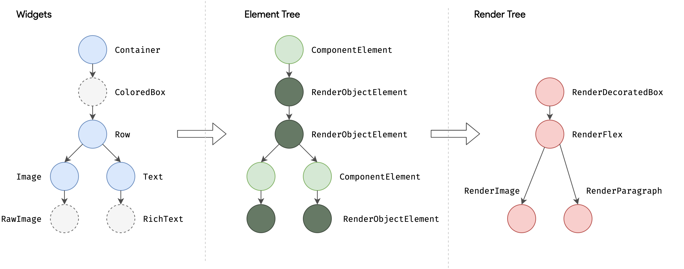
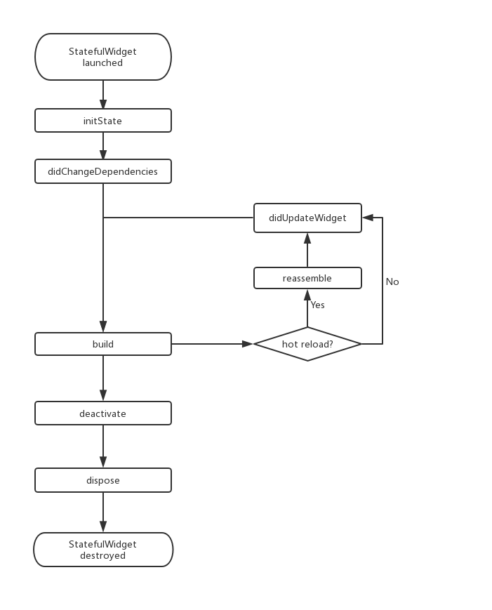

# Dart
## Dart 重要 的概念如下:
- 所有的东西都是对象，无论是变量、数字、函数等都是对象。所有的对象都是类的实例。 所有的对象都继承自内置的Object类。这点类似于 Java语言“一切皆为对象” 。 
- 程序中指定数据类型使得程序合理地分配内存空间，并帮助编绎器进行语法检查。但是，指定类型不是必须的。 Dart语言是弱数据类型。 
- Dart代码在运行前解析。 指定数据类型和编译时的常量，可以提高运行速度。
- Dart程序有统一的程序人口: main()。 这一点与 Java、 C/C++语言相像。
- Dart 没有public、 protected 和 private 的概念 。 私有特性通过变量或函数加上下划线来表示。
- Dart 的工具可以检查出警告信息( warning)和错误信息( errors)。 警告信息只是表
明代码可能不工作，但是不会妨碍程序运行 。 错误信息可以是编译时的错误，也 可能是运行时的错误 。 编译 时的错误将阻止程序运行，运行时的错误将会以异常 (exception)的方式呈现 。
- Dart 支持 anync/await 异步处理。

## 面向接口
- Dart是面向接口编程，而非面向实现，即关注对象的行为而非它的内部实现；
- Dart类型基于接口，而不是类，即所有的类都能够被其他类继承、实现，除了基本类型；
- 方法不能`final`修饰，所以允许重写几乎所有方法；
- `accsesor`方法，即`set/get`默认创建，自动将所有对象进行封装，确保所有外部操作都通过存取方式来操作；
- 构造函数运渠对对象进行缓存，或者从子类型创建实例，因此使用构造函数并不意味绑定了一个具体的实现，例如：`Device.fromJson()`；

## 动态类型语言
- 在语法层面上不一定要声明实例的类型，可以使用`var`，但会降低代码可阅读性；
- 类型对运行时的语义没有影响；

## 状态
> Flutter中的状态理念与React中的一致，核心思想就是组件化的思想，应用由组件搭建而成，而组件中最重要的概念就是`State`（状态），`State`是一个组件的UI数据模型，是组件渲染时的数据依据。Flutter可以认为是一个巨大的状态机，用户的操作、请求API和系统事件的触发都是推动状态机的触发点，触发点通过调用`setState`方法推动状态机响应，生命周期如下：


## 关键字
> 关键字( 56 个)如下: abstract, do, import, super, as, dynamic, in, switch, assert,
else, interface, sync*, enum, implements, is, this, async*, export, library, throw, await, external, mixin, true, break, extends, new, try, case, factory, null, typedef, catch, false, operator, var, class, final, part, void, const, finally, rethrow, while, continue, for, return, with, covariant, get , set , yield*, default, if, static, deferred。

## `as`、`is`、`is!`
- `as`
  - 设置别名，即`import 'dart:math' as dartMath;`  
  - 类型转换，即`(obj as List).length;`
- `is`
  - 当`obj`实现了`T`的接口时，`obj is T`是true，`obj as T`可以将`obj`类型转换成`T`类型；
  - 注意：`is`并不检查对象是否为某个类或其子类的实例；

## `operator`
- 符号定义，即定义`+`等符号具体操作或重写运算符；


# UI
## Widget 
- `Widget`是一个抽象类，继承自`DiagnosticableTree`诊断树，功能是“描述一个UI元素的配置信息”
- widget复用判定：即两个对象的`runtimeType`与`key`相等
```
  static bool canUpdate(Widget oldWidget, Widget newWidget) {
    return oldWidget.runtimeType == newWidget.runtimeType
        && oldWidget.key == newWidget.key;
  }
```
- 一般不会直接继承`Widget`来实现组件，而是`StatelessWidget`或`StatefulWidget`

## 四棵树
- Flutter 框架的的布局、绘制处理流程：
 - 根据`Widget`树生成一个`Element`树，`Element`树中的节点都继承自`Element`类。
 - 根据`Element`树生成`Render`树（渲染树），渲染树中的节点都继承自`RenderObject`类。
 - 根据渲染树生成`Layer`树，然后上屏显示，`Layer`树中的节点都继承自`Layer`类。
> 真正的布局和渲染逻辑在 Render 树中，Element 是 Widget 和 RenderObject 的粘合剂，可以理解为一个中间代理，这里需要注意：
三棵树中，`Widget`和`Element`是一一对应的，但并不和 `RenderObject`一一对应。比如`StatelessWidget`和`StatefulWidget`都没有对应的`RenderObject`，渲染树在上屏前会生成一棵`Layer`树。

    按照惯例，widget 的构造函数参数应使用命名参数，命名参数中的必需要传的参数要添加required关键字，这样有利于静态代码分析器进行检查；在继承 widget 时，第一个参数通常应该是Key。另外，如果 widget 需要接收子 widget ，那么child或children参数通常应被放在参数列表的最后。同样是按照惯例， widget 的属性应尽可能的被声明为final，防止被意外改变。
    
## Context
> `build`方法有一个`context`参数，它是`BuildContext`类的一个实例，表示当前`widget`在`widget`树中的上下文，每一个`widget`都会对应一个`context`对象（因为每一个`widget`都是`widget`树上的一个节点）。实际上，`context`是当前`widget`在`widget `树中位置中执行"相关操作"的一个句柄(handle)，比如它提供了从当前`widget`开始向上遍历`widget`树以及按照`widget`类型查找父级`widget`的方法。例如：
> ```
> // 在 widget 树中向上查找最近的父级`Scaffold`  widget 
Scaffold scaffold = context.findAncestorWidgetOfExactType<Scaffold>();
> ```


## StatefulWidget
> 和`StatelessWidget`一样，`StatefulWidget`也是继承自`widget`类，并重写了`createElement()`方法，不同的是返回的`Element`对象并不相同；另外`StatefulWidget`类中添加了一个新的接口`createState()`。

- `StatefulElement`间接继承自`Element`类，与`StatefulWidget`相对应（作为其配置数据）。`StatefulElement`中可能会多次调用`createState()`来创建状态（State）对象。

- `createState()`用于创建和`StatefulWidget`相关的状态，它在`StatefulWidget`的生命周期中可能会被多次调用。例如，当一个`StatefulWidget`同时插入到`widget`树的多个位置时，`Flutter`框架就会调用该方法为每一个位置生成一个独立的`State`实例，其实，本质上就是一个`StatefulElement`对应一个`State`实例。

> 而在`StatefulWidget`中，`State`对象和`StatefulElement`具有一一对应的关系，所以在`Flutter`的SDK文档中，可以经常看到“从树中移除`State`对象”或“插入`State`对象到树中”这样的描述，此时的树指通过`widget`树生成的`Element`树。

## State
- 一个`StatefulWidget`类会对应一个`State`类，`State`表示与其对应的`StatefulWidget`要维护的状态，`State`中的保存的状态信息可以：
    - 在`widget`构建时可以被同步读取。
    - 在`widget`生命周期中可以被改变，当`State`被改变时，可以手动调用其`setState()`方法通知`Flutter`框架状态发生改变，`Flutter`框架在收到消息后，会重新调用其`build`方法重新构建`widget`树，从而达到更新UI的目的。
- State 中有两个常用属性：
    - `widget`，它表示与该`State`实例关联的`widget`实例，由`Flutter`框架动态设置。注意，这种关联并非永久的，因为在应用生命周期中，UI树上的某一个节点的`widget`实例在重新构建时可能会变化，但`State`实例只会在第一次插入到树中时被创建，当在重新构建时，如果`widget`被修改了，`Flutter`框架会动态设置`State`。 `widget`为新的`widget`实例。
    - `context`，`StatefulWidget`对应的`BuildContext`，作用同`StatelessWidget`的`BuildContext`。

### State生命周期
- 创建
```
initState
didChangeDependencies
build
```
- 热重载刷新
```
reassemble
didUpdateWidget 
build
```
- 热重载移除
```
reassemble
deactive
dispose
```
#### 生命周期函数
- `initState`：当`widget`第一次插入到`widget`树时会被调用，对于每一个`State`对象，`Flutter`框架只会调用一次该回调，所以，通常在该回调中做一些一次性的操作，如状态初始化、订阅子树的事件通知等。不能在该回调中调用`BuildContext.dependOnInheritedWidgetOfExactType`（该方法用于在 widget 树上获取离当前`widget`最近的一个父级`InheritedWidget`，关于`InheritedWidget`我们将在后面章节介绍），原因是在初始化完成后，`widget`树中的`InheritFrom widget`也可能会发生变化，所以正确的做法应该在在`build()`方法或`didChangeDependencies()`中调用它。

- `didChangeDependencies()`：当`State`对象的依赖发生变化时会被调用；例如：在之前`build()`中包含了一个`InheritedWidget`，然后在之后的`build()`中`Inherited widget`发生了变化，那么此时`InheritedWidget`的子`widget`的`didChangeDependencies()`回调都会被调用。典型的场景是当系统语言`Locale`或应用主题改变时，`Flutter`框架会通知`widget`调用此回调。需要注意，组件第一次被创建后挂载的时候（包括重创建）对应的`didChangeDependencies`也会被调用。

- `build()`：此回调读者现在应该已经相当熟悉了，它主要是用于构建`widget`子树的，会在如下场景被调用：
    - 在调用`initState()`之后。
    - 在调用`didUpdateWidget()`之后。
    - 在调用`setState()`之后。
    - 在调用`didChangeDependencies()`之后。
    - 在`State`对象从树中一个位置移除后（会调用`deactivate`）又重新插入到树的其他位置之后。
`reassemble()`：此回调是专门为了开发调试而提供的，在热重载(`hot reload`)时会被调用，此回调在`Release`模式下永远不会被调用。

- `didUpdateWidget()`：在`widget`重新构建时，`Flutter`框架会调用`widget.canUpdate`来检测`widget` 树中同一位置的新旧节点，然后决定是否需要更新，如果`widget.canUpdate`返回`true`则会调用此回调。正如之前所述，`widget.canUpdate`会在新旧`widget`的 `key`和`runtimeType`同时相等时会返回`true`，也就是说在在新旧`widget`的`key`和`runtimeType`同时相等时`didUpdateWidget()`就会被调用。

- `deactivate()`：当`State`对象从树中被移除时，会调用此回调。在一些场景下，`Flutter`框架会将`State`对象重新插到树中，如包含此`State`对象的子树在树的一个位置移动到另一个位置时（可以通过`GlobalKey`来实现）。如果移除后没有重新插入到树中则紧接着会调用`dispose()`方法。

- `dispose()`：当`State`对象从树中被永久移除时调用；通常在此回调中释放资源。



